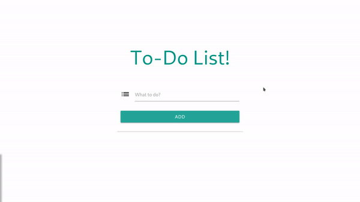

# Vue.js To-Do List Application!

A simple to-do list app created with only Vue.js! The todos added in this app is stored in localStorage, so it doesnt matter whether if the webpage is refreshed or even closed, the data will still gonna be there. Try it live on https://dist-qybefekkix.now.sh

## Pretty Cool FYI
This repo is being featured on [vuejsexamples.com](https://vuejsexamples.com/to-do-list-application-created-with-only-vue-js/)!!

### How to Run this App
```
npm install
npm run serve
```

### Compiles and Minifies for Production
```
npm run build
```

### Lints and Fixes Files
```
npm run lint
```

## GIF



## Built with

* [Vue.js](https://vuejs.org/) - JavaScript Framework
* [Materialize CSS](https://materializecss.com/) - CSS Framework

## Author

* **Muhammad Daivasmara Denaw** - [Daivasmara](https://github.com/Daivasmara)
